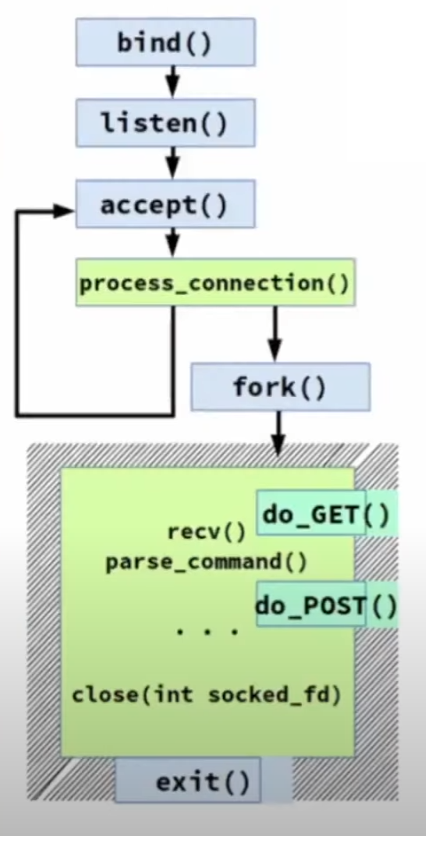

# Multiple Client Communication

*From Server-Side Point Of View*

* soket.
* bind.
* listen.
* accept - might wait for undefined time.
* read/write - might wait for undefined time.
* close.
* each client to be served by dedicated Process or Thread within the same Process.

# Dedicated Processes



* Non-blocking by design.
* Great overhead:
  * process creation.
  * memory allocation.
  * inter-process communications.

## Each client to be served in common using NON-BLOCKING operations.

* accept - NOT blocks and NOT waits.
* read/write - NOT blocks and NOT waits.

```cpp
fcntl(filedesc, F_GETFL) -> int;
fcntl(filedesc, F_SETFL, int flags);
```

with O_NONBLOCK.

---

* Local file or device: can write until there is enough RAM.
* Pipes: fixed buffer size 65536.
* TCP-socket: fixed configurable buffer size.

# Non-Blocking I/O

*Great O_NONBLOCK Flag*

* Do **NOT** switch process to Sleep or Disk-Sleep state.
* Immediately return -1 (error occured value).
* `errno` = **EAGAIN** // not an error.
* `read`/`write` operation might be retried in some future.
* `accept` return -1 and sets *EAGAIN* in case if no pending connections.

# Kernel-Side Events

* Register notifications request for a set of Events of interest.
* Process might go to Sleep state.
* The Kernel must wakeup process on Event occured.

### What It Can Handle:

* File descriptor Ready to read:
  * new data at pipe or socket.
  * new incoming connection.
  * EOF reached or connection closed by peer.
* File descriptor Ready to write
  * write buffer has free space.
* Got uncaught signal.
* Timeout reached (if set).

# Kernel Queue

* FreeBSD Kernel Queue (kqueue, kevent).
* Linux epoll (epol_create, epoll_ctl, epoll_wait)

# Compability Problems In UNIX World

* kqueue v.s. epoll.
* jail v.s. cgroup + unshare.
  *and other non-POSIX subsistems*

**Solutions:**

* Code a lot of *#ifdefs*'s
* Third-Party libraries:
  * libev
  * Boost.Asio

# POSIX Asynchronous I/O

*Queue rquest of operations:*

* aio_read
* aio_write

*Get result of queue operation:*

* aio_return
* aio_error
