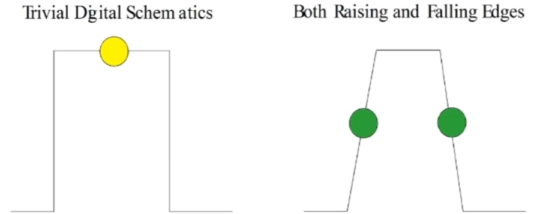

# Pysical Memory

* Logical: Address Bus + Data Bus
* Modern implementations: bus to send commands using Double Data Rate

* Specifications:
  * individual chip clock
  * bus clock
  * MT/s (Mega Transfers Per Second) - twice as clock
  * bandwidth: several bits at a time

# Process Address Space

* Any value that matches pointer size
* Each process has it's own memory
* Each process pointer addresses start from 0

# Memory Management Schemes

* x86 Real Mode Segmentation
* 2-Level Memory Paging (x86)
* 3-Level Memory Paging (x86+PAE)
* 4-level Memory Paging (x86_64)

# x86-32 Memory Paging (Таблица страниц)

* CR2 register values points to Level-1 Table for current process
* Each Level-1 Table Entry points to Level-2 Table
* Level-2 Table contains entries on individial pages
* Hardware Support: MMU (Memory Management Unit) calculate actual pointer transparently to program

# Heap Allocation

* brk system call: legacy, but simple.
* mmap system call: flexible pages allocations.
