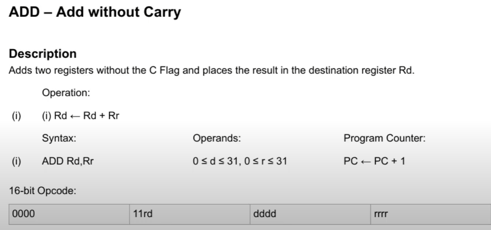

# Program Code Section

* Code section named ".text" int object file.
* Contains binary code for specific machine.
* Object files are not just binary code:
  * Symbols table.
  * Other named section.
* Tool to extract specific section: objcopy -j SECTION_NAME -O OUT_FORMAT IN_FILE_NAME.o OUT_FILE_NAME

# Standart Section

* .text - program code, executable.
* .data - static/global varialbes.
* .rodata - constants.
* .bss - like .data but not initialized.
* .debug* - debug inforamtion (create separate).

# Assembly Language

* Code generation:
  Assembly text souce or binary object code.
* Program instruction text and binary code are (almost) comletely equal.

Регулярные языки - однозначно траслируются в какое-нибудь представление и могут транслироваться назад.

Контекстно свободные граматики - вложенность в программе.

# Instruction Coding

* Reduced Instruction Set Compoting (AVR, ARM, MIPS, PowerPC)

  * simple commands
  * commands of fixed size
  * easy to access random command in a stream
* Complex Instruction Set Computing (Intel x86)

  * one command might do a lot of things
  * commands of variable size
  * hard to make out-of-order optimization

Машинное слово - длинна одной инструкции.

* Application Binary Interface - convention on function calls and terminal data representation.

# Simulation

* Application-Level Code Translation
  * To run code other CPU on the same operating system. (Apple Rosetta, Linux qemu-user).
  * Complete System Emulation (qemu-system-Name).
