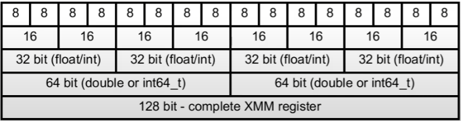

# Vector instruction (128 bit)

* 128-bit register XMM0...XMM15d:
* Vertical operation: common actions for several parts (arithmetic)
* Horizontal operations: vector to scalar (min/max value, dot product)

# Vector Instruction Setx (x86)

* MMX - XMM register, integer only
* SSE - XMM register, floating-point
* AVX - YMM register (256 bit)
* AVX-512 - ZMM register (512 bit)
* SIMD (Single Instruction, Multiple Data — «одна инструкция, множество данных»)
  [example program](https://godbolt.org/z/1fs9fPK8j)

# OpenMP

* Compile extensions (#pragma)
* Allows SIMD instructions.
* Allows multithreding.

# BLAS (basic linear algebra subprograms)

* Interface for common linear algebra routines.

# Alignment

* Probem: use less thiks to read vector
* Solution: align vector in memory by register size
* Cons: not all data might be aligned

# x86 Cache Levels

* L1 (index0 + index1 for intel) - nearest instruction and data caches.
* L2 - core related cache.
* L3 - common cache for all cores.
* /sys/devices/system/cpu/*
