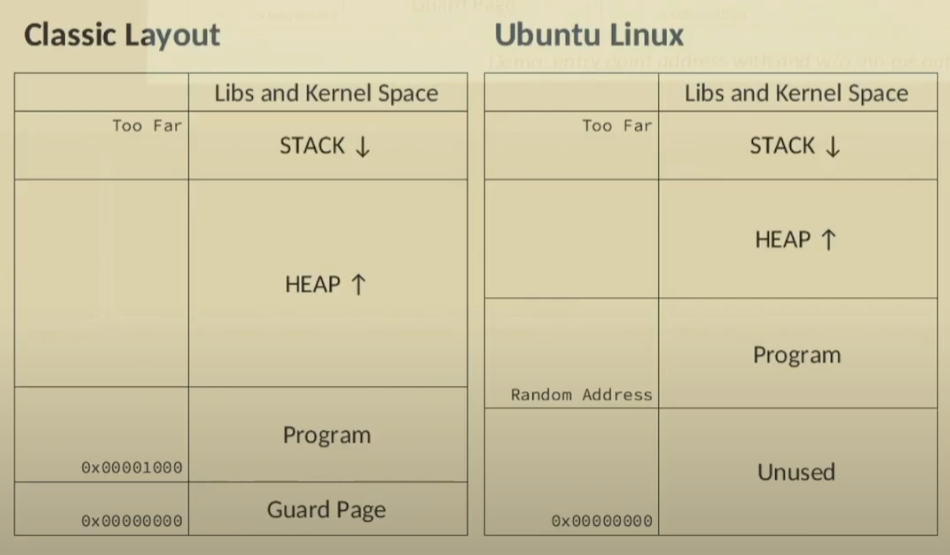

# Process Layout

Виртуальное адресное пространство процесса — это набор виртуальных адресов, которые процесс может использовать для доступа к памяти. Оно обеспечивает изоляцию процессов друг от друга и позволяет системе эффективно управлять памятью.

**Основные характеристики:**

* **Изоляция процессов:** Каждый процесс имеет собственное виртуальное адресное пространство, что предотвращает несанкционированный доступ к памяти других процессов.
  [Microsoft Learn](https://learn.microsoft.com/ru-ru/windows-hardware/drivers/gettingstarted/virtual-address-spaces?utm_source=chatgpt.com)
* **Преобразование адресов:** Виртуальные адреса преобразуются в физические с помощью таблиц страниц, управляемых операционной системой и аппаратным обеспечением.
  [Википедия](https://ru.wikipedia.org/wiki/%D0%92%D0%B8%D1%80%D1%82%D1%83%D0%B0%D0%BB%D1%8C%D0%BD%D0%B0%D1%8F_%D0%BF%D0%B0%D0%BC%D1%8F%D1%82%D1%8C?utm_source=chatgpt.com)
* **Размер адресного пространства:** В 32-разрядных системах виртуальное адресное пространство обычно составляет 4 ГБ, разделенных между пространством пользователя и системным пространством. В 64-разрядных системах этот объем значительно больше, что позволяет использовать более крупные объемы памяти.
  [Microsoft Learn](https://learn.microsoft.com/ru-ru/windows-hardware/drivers/gettingstarted/virtual-address-spaces?utm_source=chatgpt.com)

# Functions

* Local variables to be stored on stack

# Procedure Linkage Table (.plt)

* Section .plt - code for 'far away' jumps
* Section .got.pt and .got - real addresses of function and static variables.
* Any library might be lacated at arbitrary location.

# /lib/ld-linux.so

* Virtual 'interpreter' of ELF programs..
* Execution stages:
  1. Load (map) program into memory.
  2. Find and load all dependent libraries /etc/ld.co.conf and LD_LIBRARY_PATH.
  3. Allocate memory for stack.
  4. Setub GOT tables.
  5. Jump to program Entry Point.
