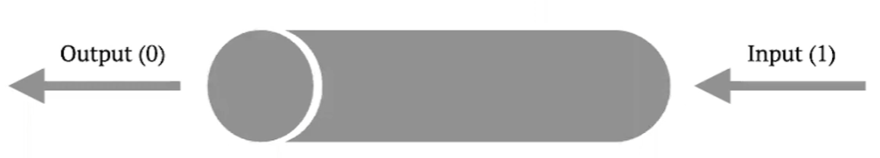

# Unix Processes

* Isolated memory for each process.
* Total isolation guaranteed by CPU hardwaref features.
* Cons: processes not communicate directly each other.
* Solution: several special ways to communicate provide by Kernel.

# Inter-Process Communication

* Regular Files
  * the most easy way.
  * not possible to notify on changes.
* UNIX Signals
  * just notifies process.
  * signals sent not to be counted.
  * has no information to deliver.
* RT Signals
  * POSIX extension (Linux and FreeBSD, but not macOS).
  * can deliver just one integer of machine word size.

### Sequens Access (файловый дескриптор)

* Pipes and FIFOs (named pipes).
  * just file descriptors to read/write.
  * one-to-one communication.
* Sockets.
  * dedicated 'server' and 'client' roles.
  * one-to-many communication.

### Random Acess:

* Ananymous shared memory maps (mmap with MAP_SHARED).
* Named shared memory maps (mmap + shm_open).
* Legacy System-V shared memory segments (shmget).

# UNIX Pipes

````bash
 ls -l       |       wc -l
Command 1   PIPE   Command 2
````

* Starts two process at a time.
* stdout of first process is linked to stdin of second one.
* Shell creates a pipe before two processes launching.



* System call: int pipe(int fds[2]);
  * parameter is output of two integers.
  * fds[0] is read-only file descriptor, fds[1] is write-only.

```cpp
#include <stdio.h>
#include <string.h>
#include <unistd.h>


void read_from_channel(int channel[2]) {
  ....  
    count = read(channel[0], buffer, sizeof buffer);
  ....
}

void write_to_channel(int channel[2], const char *data) { 
    write(channel[1], data, strlen(data));
    ....
}

int main() { 
    int channel[2];  
    pipe(channel); 

    // Try to change read/write order 
    // Можно работать с каналом между родительским и дочерним процессом.
    write_to_channel(channel, "Hello"); 
    read_from_channel(channel);
    return 0;
} 
```

# Pipes Usage

* `fork` system call preserver opened or created file descriptors.
* Parent might create pipe that will be accessible by child.

### Read Rules

* Read is possible if there exists at least one writer.
* Read from pipe with no writer acts like EOF (End Of File).
* Be careful with unclosed pipe writers to avoid dead lock.

### Write Rules:

* Write is possible if there exists at least one reading sink.
* Write is pipe with no reading sinks causes SIGPIPE error.

# Exceed Buffer Size

* Pipe has limited buffer size.
* POSIX minimum size is 512 bytes.
* Linux/FreeBSD/macOS implementations has buffer of size 64Kbytes.

### Write Rules

* System call `write` causes process to go into sleep state if no data read from pipe and buffer filled out

# Non-Blocking I/O

* System call open has **O_NONBLOCK** option ot make file descriptor non-blocking for read and write operations.
* System calls `read` and `write` returns -1 and `errno` set to **EAGAIN**.
* Already created file descriptors might be tuned by `fcntl` (file control).

# Several Write Sources

* Pipe's write side might have several writers.
* I is guaranteed each source have a block of continuous size:
  * at least 512 bytes by POSIX standart.
  * 4096 bytes for most modern systems (Linux/FreeBSD/macO).

# File Descriptors Duplication

```cpp
int dup2(int old_fd_number, int new_fd_number);
```

* Closes new_fd_number if case if exists.
* Create new file descriptor with value of new_fd_number pointing the same file object old_fd_number.
* Закрытие и открытие - атомарная операция.

# Pipes Usage In Real Life

* File descriptors 0, 1 and 2 in Terminal applications.
* Using third-party programs as components Examples:
  * use of gcc and gdb in CLion/QtCreator/VSCode.
  * use of mplayer in Video Players with GUI.
  * ...many others.

# Named Pipes (FIFO)

* Fifo:
* special file type created by mkfifo command or mkfifo function.
* can be opened like regular file by its name.
* behavior is like pipe.
