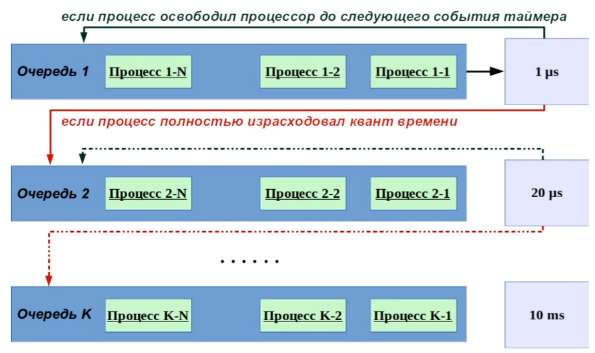
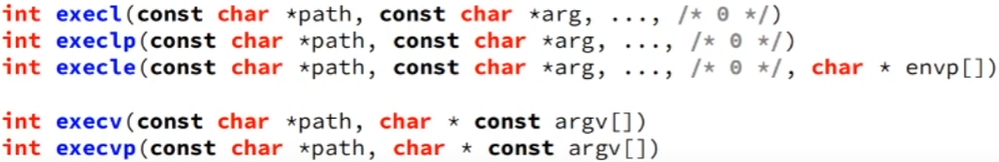
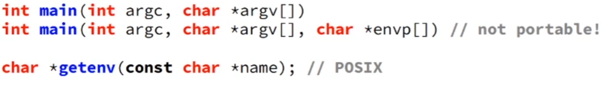

# Процесс

* Процесс - это экземпляр программы в одном из состояний выполнения.
* Процесс в UNIX - это изолированное виртуальное адресное пространство в UNIX-системах.

# Аттрибуты процесса

*Память*:

* Значение регистров процесса.
* Таблица и каталог страниц виртуального адресного пространства (отображения).
* Private и Shared страницы памяти.
* Отображение файлов в памяти.
* Отдельный стек в ядре для обработки системных вызовов.

*Файловая система*:

* Таблица файловых дескрипторов.
* Текущий каталог.
* Корневой каталок.
* Маска аттрибутов создания нового файла - umask.

*Другие аттрибуты*:

* Переменные окружения.
* Лимиты.
* Счетчики ресурсов.
* Идентификаторы пользователя и группы.

# Жизненный цикл процесса

* Running - выполняется.
* sTopped - остановлен.
* Suspended - временно приостановлен (ожидает события).
* Zombie - процесс не функционирует (не убить).

# Приоритет

* от -20 (самый высокий) до 19 (самый низкий).
* Численное значение - сколько раз пропустить планировщиком заданий.

### Multilevel Queue



# Создание процесса

```cpp
pid_t result = fork() # создает копию текущего процецасса
```

* res == -1 -- ошибка.
* res == 0 -- дочерний процесс.
* res > 0 -- родительский процесс, PID процесса.

# Копия процесса

* Копируется: Память (страницы как COW), регистры.
* Не копируются: PID, PPID, сигналы ожидающие доставки, таймеры, блокировка файлов.

# Завершение работы процесса.

* Системный вызов _exit(int).
* Функция exit(int).
* Оператор return INT в main.

```cpp
pid_t waitpid(pid_t pid, int *st, int flags); # если не считать код возрвата дочернего проецесса: zombie
```

* Аргументы:
  * pid - id процесса.
  * st - куда записывать результат работы.
  * flags - флаги ожидания:
    * 0 - по умолчанию.
    * WHOHANG - не ждать, а только проверить.
    * WUNTRACED - считать событие sTopped.

# exec

Замещение тела процесса другой программой.

Часто применяется в паре с fork.

* Передача параметров: 'l' - переменной число арг.; 'v' - ммассив параметров.
* Передача перменных окружения: 'e' - задается envp.
* Поиск программы в PATH.


