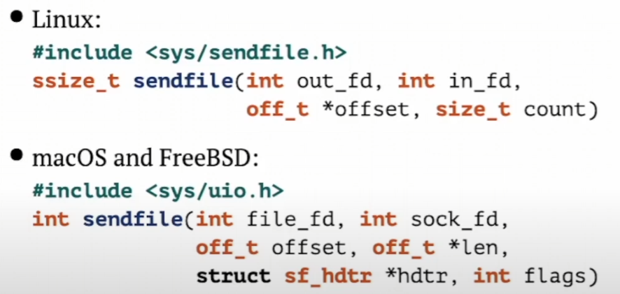
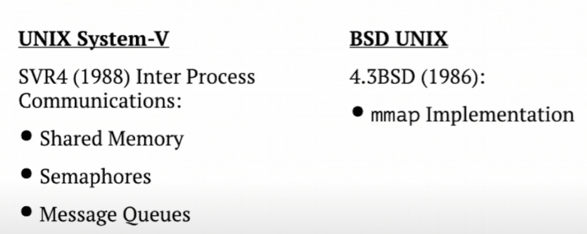

# Pipes And Sockets

**Inter-Process Communications**

> Aggressive involves The Kernel while interaction.

# `sendfile`

*Non-POSIX System Call*



* Prevents data copying from/to kernel/user space.
* Not suitable to write on-the-fly data.

# Massive Data IPC (Inter-Process Communication)

**RL Exampl**:

*Processes envolved:*

* Xorg server.
* mplayer command line tool.
* smplayer GUI frontend.

*Interaction:*

* pipes between tool and frontend.
* **shared memory** between mplayer and Xorg.

# Memory Sharing

**x86 Address Page Entry**


* Memory Management Unit (MMU) - hardware CPU subsystem for transparent address translation
* Translation Lookahead Buffer (TLB) - cache inside CPU to store translation tables for current process.

# Shared Memory OS Support

SystemV v.s. BSD



# Shared Memory

## System-V Implementation

* Dedicated namespace for Shared Memory Segments.
* Dedicated Shared Memory Segments table into The Kernel.
* Shared Segments accessible to all processes by name.
* Must be freed by some process (last used).

## BSD Implementation

```c
void* mmap(void* addr, size_t length, int prot, int flags, int fd, off_t offset)
```

* flags
  * *MAP_SHARED* - accessible by various processes.
  * MAP_PRIVATE - accessible by owner process, children processes uses by Copy-On-Write.
* **fd** and **offset** might specify named file to share.

### Abaut fd

* Create a file accessible by distinct processes.
* Resize file using ftruncate.
* Open and attach the file using mmap.
* PROFIT.
* Who is responsible to delete the file?
* Consumes disk space.

### tmpfs File System

* Temporary Storage to keep files until unmounted.
* Might have fixed size to be changed later.
* Consumes just memory by usage.
* Might use swap area while RAM is gone.

  ````bash
  tmpfs on /dev/shm type tmpfs (rw, nosuid, nodev)
  ````

## POSIX

```c
int shm_open(const char* name, int flags, int mode);
```

Opens file descriptor for Shared Memory usage.

```c
int shm_unlink(const char* name);
```

Release unused SHM resource.

* *Linux Implementation:*
  * library routines but system calls: requires -lrt link flag.
  * just a regular file inside /dev/shm.
  * must NOT contain '/' symbol inside name to prevent subdirectories creation.
* *macOS and FreeBSD implementations:*
  * dedicated namespace but not a file.
  * name must start from '/' symbol on FreeBSD but not macOS.
  * discoverable by **posixshmcontrol** tool on FreeBSD but not macOS.
  * might be sandboxed on macOS using sandox-exec.
  * NOT discoverable by ipcs tool!

# Data Race Problem

## Multiple Task Execution

### Single Processor System

* Proceses and Threads are switched by Task Scheduler.

### At least Two Processor System

* Processes and Threads are switched by Task Scheduler.
* Several Tasks might be running at a time.

## Shared Memory For IPC Usage

* Several Processes shared the same Memory Segment.
* Proceses do not know about each other state.
* Secondary IPC channel required: Signal? Pipe?

# Semaphore

**Inter-Thread And Inter-Process Comunications**

* Unsigned Integer Counter.
* Operations:
  * Increment counter (**Release** Semaphore).
  * decrement counter if possible (**Acquire** Semaphore).
* Both Realese and Acquire operation are *atomic*.

# Atomicity

* Async-Signal guaranteed atomicity
  `typedef int sig_atomic_t;` // for moder OS.
* Multiple CPU's access level atomicity:
  requires use atomic CPU operations on basic types.
* Use Guards for complex shared data structures:
  * **mutex** for inter-thread data sharing.
  * **semaphore** both for inter-thread and inter-process data sharing.

# POSIX Semaphores

**#include < semaphores.h>**

* Special type `sem_t*` to be stored into dedicated memory pages: might have special cache-related flags.
* Implemented using atomic counters.
* Operations:
  * `sem_post` - release semaphore (inc value).
  * `sem_wait` - trey to acquire semaphore (dec or wait).
  * `sem_getvalue` - just read but not change value.

**Unnamed**: to use by Threads inside one Process or related Processes.

```c
int sem_init(sem_t* sem,
             int pshared, /* 0 - MAP_PRIVATE
                             1 - MAP_SHARED*/
             uint32_t initial)
```

**Named**: to use by unrelated Processes.

```c
sem_t* sem_open(const char* name,
                int oflag, /* like open */
                mode_t mode, /* like open */
                uint32_t initial)
```

# Mutex

#include < pthread.h>

* Like binary Semaphore with initial value = 1.
* Two operations:
  * pthread_mutex_lock - equal to *acquire*
  * pthread_mutex_unlock - equal to *release*
* Only for Threads.

## Mutex - Futex

**Fast Userspace muTEX**

* Two major operations: `wait` and `wake`.
* Handled by `futex` system call: no wrapper in *glibc*.
* Linux-specific system call but not macOS or FreeBSD.

# Posix Synchronization Structures

**Real Life Usage**

* Synchronization between Threads within the same Process: Mutex, Conditional Variable, Seamaphore.
* Synchronization between disctinct processes: Semaphore.
