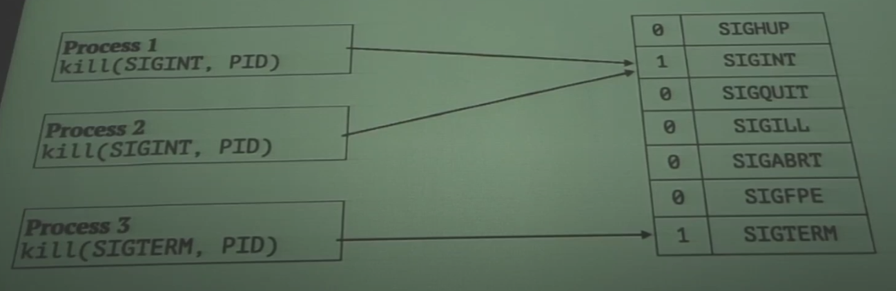

# Unix Processes

* Might exit itself:
  * return from main function.
  * use `exit` function.
  * use `_exit` system call.
* Parent can examine exit status using `waitpid` function and `WEXITSTATUS()` macro.
* Might be terminated by a signal than sent by someone:
  * kill or killall command from Terminal.
  * timeout reached while started via timeout command.
  * Ctrl+C pressed.
  * Terminal closed
  * unhandled error occurred.
  * system restart or shutdown.
* Process can not predict these events by itself.
* Exit status is undefined while terminated by signal.

# Signal Reasons

* An error detected by The Kernel:
  * memory segmentation faults.
  * write to pipe socked with no readers.
  * division by zero.
  * illegal CPU instruction.
* An error detected by process itself:
  * assertion failed or abort function called.
  * unhandled error occured.
  * system restrart or shutdown.
* Some another process sent signal.

# The Signal

* Asynchronous event from:
  * The Kernel.
  * some another process of the same user or root user.
* Process action of signal arrived:
  * just ignore (example: child process finished).
  * terminate (example: system shutdown).
  * change state (example: stop request from debugger).
  * make custom actions.

# Standard POSIX Signals.

**man 7 signal**


| **Number** | **Name** | **Default Action** | **Description**         |
| ---------- | -------- | ------------------ | ----------------------- |
| 1          | SIGHUP   | Term               | Lost stdin and stdout   |
| 2          | SIGINT   | Term               | Ctrl+C                  |
| 3          | SIGQUIT  | Core               | Ctrl+\\                 |
| 4          | SIGILL   | Core               | Illegal CPU instruction |
| 6          | SIGABRT  | Core               | abort()                 |

* **Term** — завершение процесса.
* **Core** — завершение процесса с созданием core-файла для отладки через gdb.
* `cat /var/log/aport.log`


| Number | Name    | Default Action | Description        |
| ------ | ------- | -------------- | ------------------ |
| 9      | SIGKILL | Term           | Hard terminate     |
| 11     | SIGSEGV | Core           | Memory error       |
| 13     | SIGPIPE | Term           | Broken pipe        |
| 15     | SIGTERM | Term           | Goodbye            |
| 17     | SIGCHLD | Ign            | Child finished     |
| 18     | SIGCONT | Cont           | fg command         |
| 19     | SIGSTOP | Stop           | Ctrl+Z             |
| 23     | SIGURG  | Ign            | Socket urgent data |

* **Ign**: do nothing (игнорирование сигнала).
* **Stop**: switch to stopped process state (процесс переводится в состояние "остановлен").
* **Cont**: switch back from stopped to running process state (возобновление выполнения остановленного процесса).

# Core Dump

* Process memory dump.
* Usable for gdb debugger.
* To be manager by systemd.

```bash
/usr/sbin/sysctl 
kernel.core_pattern 
ulimit -c
```

# Signals Handling

```c
#include <signal.h>

// Linux
typedef void (*sighandler_t)(int);
sighandler_t signal(int signum, sighandler_t handler);

// macOS and FreeBSD
typedef void (*sig_t)(int);
sig_t signal(ing signum, sig_t handler);
```

### Various UNIX-like Systems

* System-V style: Solaris, AIX
* BSD style: Linux, FreeBSD, macOS

gcc -std=c11 строго по стандарту

gcc -std=gnu11 +макросы _GNU_SOURCE и _BSD_SOURCE

* System-V handler resets to default after first processing, BSD not.
* System-V signal handlers might be called while processing handler, BSD waits until handler will be finished.
* System-V signal interrupts system calls (EINTR error), BSD restarts them (all but sleep, pause, select).

```c
#include <signal.h> 
struct sigaction { 
  void (*sa_handler)(int); 
  void (*sa_sigaction) (int, siginfo_t *, void *); 
  sigset_t sa_mask; 
  int sa_flags; 
  void (*sa_restorer)(void); 
}
int sigaction(int signum, 
              const struct sigaction *act, 
              struct sigaction *oldact /* might be NULL */);
```

# Signal-Safety Signal Handler

* To be called at random time.
* Uses the same stack as program itself.
* Stack location might be tuned by signaltstack.
* x86-64/Linux calling convertion warrants Red Zone by size of 128 bytes not to be affect by stack handler.
* may use only async-signal-safe function.

### Function classes:

* unsafe (example: putchar_unlocked)
* MT-safe (example: putchar)
* AS-safe (example: write)
* Safe while not dealing global snprintf.
* Good architecture design for signal handling: just set flag on signal received and let process flag by main program.

### sig_atomic_t

* POSIX sig_atomic_t data type:
  * signed integer.
  * just typedef to int for most modern systems.
  * warrants atomic load/save operations at lavel of signal processing but not multithreding.
  * use `volatile`.

# Signal Handling In Practice

* SIGTERM and SIGINT: finish current connection, stop accepting new connections, write log file than exit.
* SIGHUP: reload configuration file.
* SIGCHILD: read process state to eliminate Zombie-process.
* SIGABRT, SIGSEGV: write log file and try to recover, maybe restart.

# Signal Delivery

* Signals Pending Mask - process attribute storing incoming events
* Not to be inherited by fork!
* Only signal presence have matter but not received count!



### Under The Hood

#### Pending mask

* The Kernel or another process just sets flag into pending mask of target process.
* kill system call is not blocking: execution continues until scheduler switches into target process.
* Scheduler checks first for signals mask than continues execution of main program code.

#### Signal mask

* Signals Mask - process attribute storing filter for signals.
* SIGKILL and SIGSTOP may not be filtered.
* To be inherited by fork in opposite to Pending Signals Mask.
* Masked signals got may be delivered on mask changed.

### Related System Calls And Functions

* Mask set system routines:
  * sigprocmask - for current process/thread
  * pthread_sigmask - for current thread, leaving Linux-specific thread-related signals 32 and 33 unchanged
  * in case of multithreading usually there one specific thread for signals handling
* Temporary changing mask by sigsuspend:
  * from man page: "Temporarily replaces the signal mask of the calling thread with the mask given by mask and then suspends the thread until delivery of a signal whose action is to invoke a signal handler or to terminate a process."
  * just suspends process execution until on of signals from inverted mask received
* Signal sets manipulation: sigemptyset, sigfillset, sigaddset, sigdelset, sigismember

# Signal Waiting Routines

* pause() - until any ulocked signal received.
* sigsuspend(sigset_t* set) - block execution until one of just allowed signal recived while ignoring all other signals.


# Use case: just notify another process.
