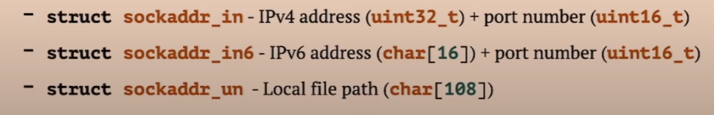

# Socket

*man 2 socket*

* File descriptor for input/output.
* Distinct server process which manages connection name.
* Several client processes which connects to server using common name.
* Socket name families:
  * UNIX: local file of special type 'socket'.
  * IPv4 and IPv6: host address + port number.
  * RAW Packet: network card name.

````c
int socket(int domain, int type, int protocol)
````

Creates new socket and return its file descriptor

* domain - address family type (AF_UNIX, AF_INET, AF_PACKET).
* type - SOCK_STREAM or SOCK_DGRAM.
* protocol - 0 for auto; IPPROTO_TCP etc...
* Socket is not ready to communicate after creation.
* Might be clonned (dup2) or inherited (fork).
* Must be closed to prevent opened file leak (close).

# Socket Setup

*man 7 {unix, ip, ipv6}*

### Client role:

* Connect to server process using `connect` system call.
  ```c
  int connect(int socket, const struct sockaddr *addrtype, socklen_t address_len)
  ```

### Server role:

* Announce name to allow connection using `bind`.
  ```c
  int bind(int socket, const struct sockaddr *addrtype, socklen_t address_len)
  ```
* Create listen queue using `listen` system call.
* Accept incoming connection using `accept` system call.

### Various address struct 'inherit' abstract struct sockaddr:



# Socket Listen

*man 2 listen*

```c
int listen(int socket, int backlog)
```

*Switches socket to listen mode and creates incoming queue of size backlog.*

* backlog - incoming queue size for pending connections.
* New clients behaviour while not accepted by server:
  * if pending connections count > backlog: connection failed.
  * wait to be accepted by server otherwise.
* System-specific limit SOMAXCONN (128 for Linux).

# Socket Accept

```c
int accept(int socket, struct sockaddr *address, socklen_t *address_len);
```

Accept a new connection on a listening socket. This function is used on the server side to accept an incoming client connection.

### Parameters:

* `socket`: The file descriptor of the listening socket.
* `address`: A pointer to a `sockaddr` structure where the address of the connecting entity will be stored. Can be `NULL` if not needed.
* `address_len`: A pointer to a `socklen_t` variable containing the size of `address`. This is updated to reflect the actual size of the address. Can be `NULL` if `address` is `NULL`.


#### Return Value:

* On success: Returns a new socket file descriptor for the accepted connection. This socket is used for communication with the client.
* On failure: Returns `-1` and sets `errno` to indicate the error.

# Socket Input/Output

*man 2 {read, write, recv, send}*

```c
ssize_t recv(int socket, void *buffer, size_t buf_size, int flags);
```

Read data from socket. Flags are:

* `MSG_PEEK` - mark data as 'unread' to be read again.
* `MSG_OOB` - receive Out-of-Band priority data block.
* `MSG_WAITALL` - wait for all data but not small chunks.

```c
ssize_t send(int socket, void *buffer, size_t buf_size, int flags);
```

Write data to socket. Flags are:

* `MSG_OOB` - send Out-of-Band priority data block.
* `MSG_NOSIGNAL` - do not raise `SIGPIPE` in case of socket reader closed.

### Comparison

* `read(socket, buffer, size)` ➔ `recv(socket, buffer, size, 0)`
* `write(socket, buffer, size)` ➔ `send(socket, buffer, size, 0)`
