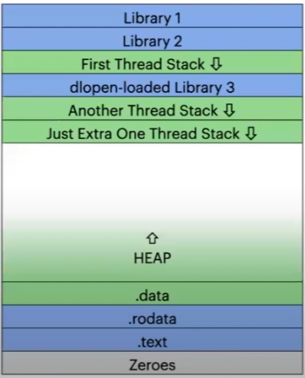
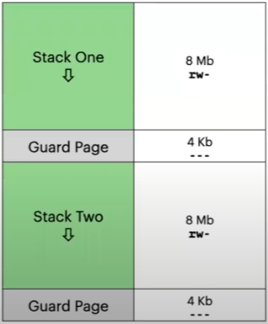
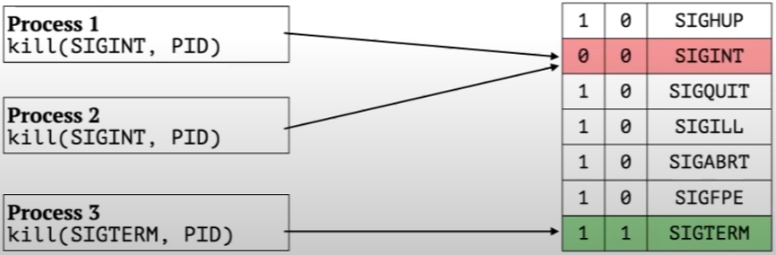

# Threads

**man 7 pthreads**

* Thread - task to be executed by processor.
* Each Trhread has it's own:
  * stack
  * CPU state (флаги, текущая инструкция, регистры).
* Several Threads shares:
  * common memory of the same Process.
  * common file descriptors of the same Process.
  * common Process attribute.

# First Thread

* Each Process has at least one Thread.
* _start function works within first started Thread.
* Each Thread can launch new Thread.

No 'main' Thread, all Threads are equal.

# exit

* _exit terminate the Process with all Threads.
* pthread_exit terminate just current Thread.
* It is possible to terminate just first Thread.

# Process Memory Layout

* Stack areas might be interleaved with dynamic library areas:
  * stack area to be created by pthread_create.
  * dynamic library to loaded by dl open.
* Every Thread can access everything within Process address space.



# Thread Stack



**And Guard Page**

* Thread stack size by default the same Process stack size.
* POSIX allows to create stack of arbitrary size (>= 16384 bytes for Linux).
* Guard Page is completely unaccesible.
* Gurd Page might have zero size.

# Scheduler Task

**Thread v.s. Process**

* Processes and Thread both are Task.
* `sched_yield` related to current Thread but not all Process Threads.
* Task limitations:
  * resources limit (**ulimit -u**): all Threads within all Processes.
  * cgroup v2 limit (/sys/fs/cgroup/..../):
    * PID count limits (pids.max).
    * Threads by default belong the same cgroup.
    * Process might be switched to threaded type (cgroup.type) instead of domain type.

# Processes v.s. Threads


| Processes                                      | Threads                                               |
| ---------------------------------------------- | ----------------------------------------------------- |
| Full isolation                                 | Common address space                                  |
| Process death has no effect to other processes | Signals affects complete Process, not just one Thread |
| Might have various privileges                  | All Threads runs within the same UID/GID              |
| Can't interact directly                        | Simple interaction without The Kernel                 |

# Thread Attributes


| **Common**                    | **Isolated**              |
| ----------------------------- | ------------------------- |
| Process ID, Parent ID         | Thread ID                 |
| UID, GID, SID                 | Stack                     |
| File Descriptors              | Signal Handler Stack      |
| File Locks                    | Priority                  |
| Signal Handlers               | Signal Mask               |
| Work Dir, Root Dir, etc.      | `errno` "global variable" |
| Limits*(but cgroup-threaded)* |                           |

# Threading APIs

* POSIX Threads (Linux, BSD, macOS).
* WinAPI (Microsoft Threads)

  ```c
  #include <Windows.h>
  CreateThread(...)
  ```

# POSIX Threads API

* Linux Implementation: libpthread.so
  * pthread_create is wrapper over clone(2) system call.
  * inter-thread communication implement in user space SIGRTMIN = 34 but not 32 due to be use by pthread library itself.

# C and C++ Standarts

* C++ since 2011

  ```cpp
  #include <thread>
  std::thread(...);

  ```

  Common subset of various OS functionality (don't **adjust** stack size and guard page).

# fork Problem

* Any Thread can call `fork` system call.
* `fork` creates copy or Proccess address space.
* include all Thread stacks.

**New Process execute only only one Task - the Thread called fork.**

* Locked Mutex and Semaphores -> **deadlock**.
* Reading streams to written by other Threads -> **deadlock**.
* The only safe blocking system call after `fork` is `exec`.
* `exec` completely replace Process address space.
* High Level language runtime allows OS interaction but lacks fork system call priror to spawning new `fork` + `exec`.

# Signal Mask

**Each Thread Has Its Own Mask**:

* Pending Signals Mask is a Process but not Thread attribute.
* Signal Handler available for all Threads.
* Signal delivers to random Thread.
* Each Thread might have its own Signals Mask using pthread_sigmask.



# Thread Cancelation

**How To Stop A Thread**:

* Thread should stop working by itself to prevent Undefined Behavior.
* Sometimes Thread must canceled:
  * by entering `cancelation point`: most system calls.
  * hard thread kill

    ````c
    while (1) { /* TRY TO STOP ME*/ }
    ````

    by internal signal.

    Thread will stop when scheduler will pick that task.

# Thread Cancelation

**How To Stop A Thread**

* `pthread_cancel` does not stop Trhead but marks Thread to be canceled.
* Thread might ignore concelation requests:
  * `pthread_setcancelstate`:
    * PTHREAD_CANCEL_ENABLE (default) or PTHREAD_CANCEL_DISABLE
  * pthread_setcanceltype:
    * PTHREAD_CANCEL_DEFERRED (default) or PTHREAD_CANCEL_ASYNCHRONOUS

**Undefined Behaviour**:

* locked mutex and semaphores.
* opened file descriptors.
* dangling pointers to heam memory.

Thread might have handler to be called before cancel: `pthread_cleanup_push`.

# Global And Local Storages

* Global (and static) variables are accessible by all Threads.
* This may lead to Data Race problem.
* Thread-Safe function uses locks.

**Thread-Safe != Async-Signal Safe**.
