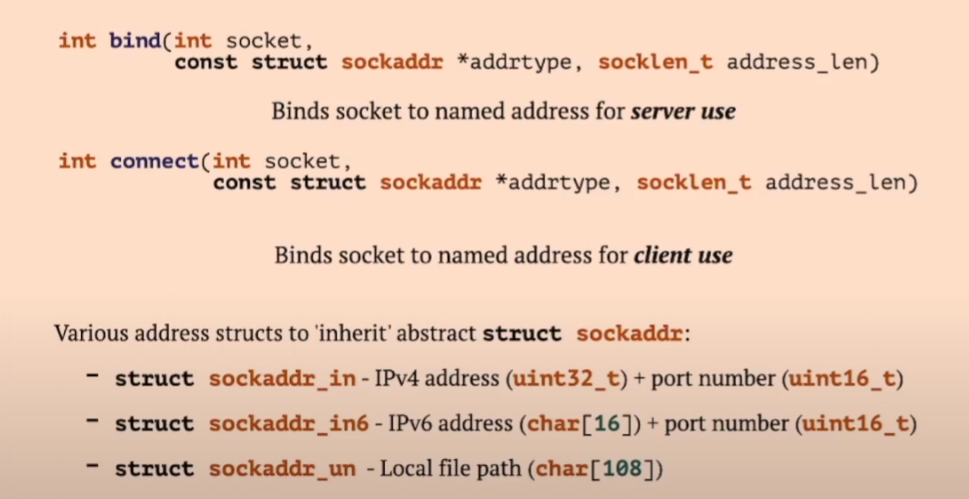
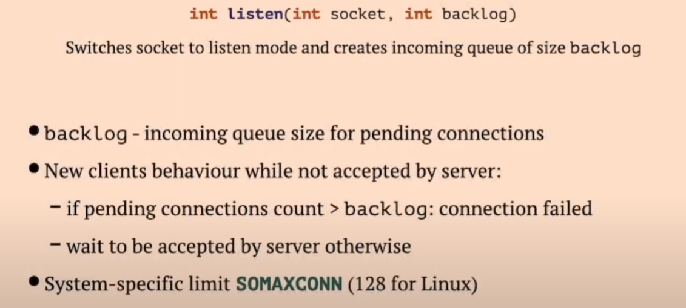

# Socket

* File desc. for input/output
* Distinct server process which manages connection name
* Several client process which connects to server using common name
* Socket name families:
  * Unix: local file of special type 'socket'
  * ip4 ip6: address + port
  * RAW Packet: network card name

# Create socket

# Socket settings

### Client role:

* Connect ot server process using `connect` system call

### Server role:

* Announce name to allow connection using `bind`
* Create listen queue using `listen` system call
* Accept incoming connection using `accept` system call

# Network

## ARP (Address Resolution Protocol)
